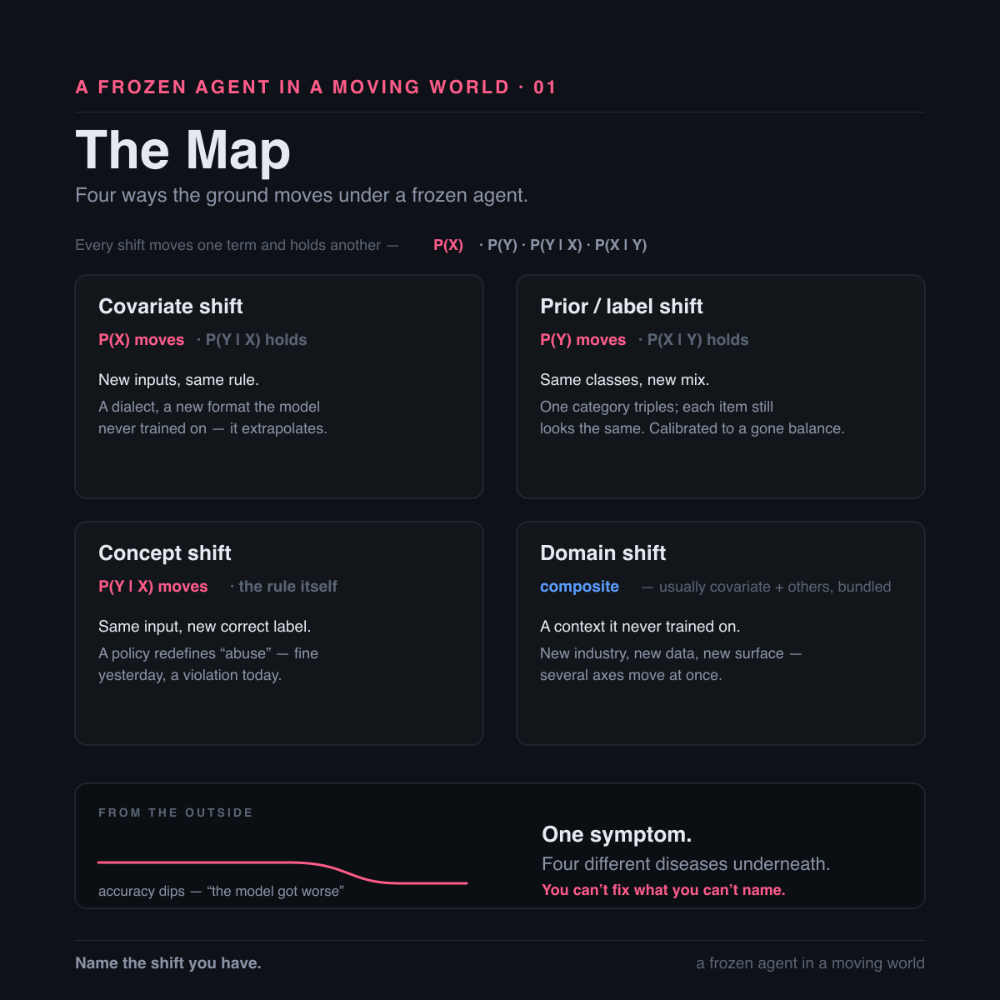

# A Frozen Agent in a Moving World

### Why a deployed LLM quietly stops being right — and what it actually costs to fix

*Hassaan · Disrupt · August 2026*

---

On Friday, Trust and Safety rewrites the policy. A category that was fine all year is a violation as of Monday — same content, new rule.

Your moderation LLM never got the memo. It is still enforcing last week's rule. No error, no alert, nothing in the logs. Just confidence, waving through the exact thing the new policy bans.

Two things in that story froze solid, and only one of them is the model.

## The race nobody markets

The AI race is sold as a race for intelligence — bigger models, higher benchmarks, who is ahead this month. There is a quieter race nobody markets: staying relevant. A trained model is a snapshot of the world the moment training stopped; the world keeps moving the instant it does.

"Then just keep training it." Labs do — new versions, continual pretraining, retrieval. But a deployed model is frozen between releases, always lagging, and a retrain swaps in a fresh general distribution, not your deployment's. The crack was never what the model knows. It is what the model assumes about the world it has been put in.

And the weights are not the only frozen thing. The moment I write the prompt — its rules, its definition of the job, its list of what counts — I pin a second snapshot on top of the first. That layer I can rewrite without retraining, and that is the real edge of an LLM: it adapts where a narrow model needs a rebuild. But a prompt once written ages too. Two frozen layers, one moving world.

The literature has a name for the moving part: **distribution shift**. The first thing worth understanding about it is that it is not one thing. It is four, and they break an agent in different ways, resist different fixes, and cost wildly different amounts of money.

## The map: four shifts, one symptom

Every shift is defined by what moves and what holds.

**Covariate shift — the inputs move, the rule holds.** `P(X)` changes, `P(Y|X)` stays. Users code-switch; a partner starts sending you a new file format; the phrasing drifts. The correct label for any given input is unchanged — the model is simply meeting inputs its training under-covered.

**Prior / label shift — the label mix moves, each class still looks like itself.** `P(Y)` changes, `P(X|Y)` stays. A fraud wave doubles the positive rate overnight. Every fraudulent case still looks exactly like fraud. But the model is scoring against the old base rate, and it under-flags the surge. Storkey (2009) is where this gets named and isolated cleanly as *prior probability shift*.

**Concept shift — the same input now has a different correct label.** `P(Y|X)` changes. That is Friday's policy rewrite: the post did not move, the rule for judging it did. Fine all year, a violation today.

**Domain shift — deployed where it never trained.** New industry, new jargon, a new customer's data. Usually a composite: covariate plus one or more of the others, breaking on several axes at once.

*Four ways the ground moves under a frozen agent. One symptom on the dashboard, four different diseases.*

From the outside, all four look identical. The dashboard sags. One symptom, four diseases — and, as we will get to, the fixes diverge in an order you would not guess.

Which is the whole point of naming them. **"The model got worse" is a symptom, not a diagnosis.** You cannot fix, and cannot even monitor, what you cannot name. And a shifted model was never useless — it was confidently misaligned. Right about most things, wrong exactly where the world moved. That is recoverable, once you know which movement you are looking at.

## When the rule moves

Concept shift deserves a closer look, because it is the one that behaves least like the others and the one an LLM changes most.

The policy rewrite did not touch a single post. It changed what counts as a violation. Same content Monday as Friday, but the correct label flipped underneath it. The model cannot feel this. Nothing it observes looks any different — it is not the terrain that shifted, it is the answer key.

Classically, this was the nightmare shift, the one with no reweighting shortcut. Your entire labeled dataset now carries the old rule's answers, which means every example is mislabeled against the new definition. The only honest fix was to relabel to the new rule and retrain. Weeks, every time the policy moved.

The LLM inverts it. A trained classifier bakes the rule into a decision boundary. An LLM keeps the specific rule in the prompt — the weights do the reading, the sentence holds the policy. So when the rule changes, you edit the sentence. Add one line, and the model applies the new definition on the very next call. No dataset, no training run, no redeploy.

The hardest classical shift became the cheapest LLM fix. The difficulty order flips.

Two cautions, and I would rather state them than sell past them.

The edit makes the new rule cheap to *express*, not automatically to *obey*. The frozen weights carry their own prior about what "abuse" means, and a definition that fights that prior can be half-followed. The edit still needs an eval to confirm the new verdicts actually land.

And all of it assumes the rule is articulable. If you can write the new definition down, a sentence fixes it. But some concepts drift where words will not follow — the line moves and nobody can quite say where. When the rule will not reduce to text, a prompt edit cannot reach it, and you are back to examples or retraining.

## Seeing it before you trust it

Naming the shift comes second. First you have to be able to *see* it — and two things blur the view, both of them in your stack rather than in the world.

**Blindness one: the model will not hold still.** Same input, same "deterministic" settings, temperature zero, and the output still changes between runs. Atil et al. (2024) measured this across five LLMs and eight tasks: accuracy swinging up to roughly 15% run to run, best-to-worst gaps as wide as ~70%. Your regression may just be the model wobbling in place.

Why would a temperature-zero model wobble at all? The usual suspect — GPU threads summing in a nondeterministic order — turns out to be mostly a red herring. He et al. at Thinking Machines (2025) trace it to batch-invariance failure in the kernels (RMSNorm, matmul, attention). Floating-point addition is not associative, so the arithmetic depends on batch size, which means your output depends on who else happened to land in the batch with you. Their fix is batch-invariant kernels, and with them inference goes bitwise-reproducible.

**Blindness two: your eval has error bars you never drew.** A single number on a slide reads as a fact. It is a sample. Miller (2024) treats every eval as an experiment and gives you the error-bar and power formulas to go with it. A move inside the noise band is not a finding — it is the width of your ruler.

Clear both, and real detection opens up. With outputs that no longer wobble, you can watch the model's own output distribution over time — predicted class balance, input-embedding distribution — and two-sample test each window against a trusted reference. Rabanser et al. (2019), "Failing Loudly," lays out this label-free machinery: you do not need ground truth to watch a distribution move.

With one blind spot that matters here. If the inputs hold and only the correct answer moves — concept shift, the Friday rewrite — the distributional test sees nothing at all. That one needs labeled spot-checks. There is no free version.

One more caveat I will not paper over: reproducible is not correct. A batch-invariant kernel makes a wrong answer wrong the same way every time, and stable-wrong is still wrong. Determinism does not buy you a right answer. It buys you a trustworthy signal.

## Fix it cheap

For twenty years, when the world moved under a model, the answer was one word: retrain. Relabel, retrain, redeploy — weeks, every time.

The LLM changes the bill. It is frozen in its weights but not in its behavior: you steer it at inference with instructions, definitions, and context. No parameter update reprices the entire problem.

"Cheap" here means *cheaper than a retraining cycle*. Not trivial, not free. And it means a targeted lever, not fiddling. Shuffling formats or piling on examples until a number moves is not adaptation, it is superstition — accuracy swings on example order and formatting alone. Sclar et al. (2023) found meaning-preserving format tweaks moving accuracy by up to ~76 points; Lu et al. (2022) found example ordering alone taking a prompt from near-SOTA to random, with good orderings that do not transfer across models. If a number moves when the meaning did not, you have not adapted anything.

So, shift by shift:

**Covariate** — new inputs, same rule. Often free: broad pretraining generalizes across a lot of surface variation. When it does not, retrieval is the robust move. Few-shot only patches the gap, and it is the brittle lever above.

**Concept** — the rule itself changed. Classically the nightmare (relabel, then retrain); for an LLM, a one-line prompt edit. This is the inversion, and it is the single biggest economic change the LLM era made to this problem.

**Domain** — a context it never trained on. Mostly you feed it the world: context, few-shot, retrieval. But domain shift is composite, so if `P(Y)` also moved, that part falls to the exception below.

**Prior / label** — and here the good news stops.

## The one you cannot prompt

The label mix moved. Each class still looks like itself. This is the shift you cannot prompt your way out of, and I am not going to soften it.

Tell a model "8% of traffic is fraud now" and it will not recalibrate. The bias lives in the output statistics, not in a rule you can edit. There is nothing to rewrite, because nothing about the *definition* changed — only the base rate, and base rates are not the kind of thing an instruction reaches.

Worse, the model already carries a label prior you never chose. Zhao et al. (2021) documented majority-label, recency, and common-token biases in GPT-3 and removed them with an affine correction estimated from content-free inputs. Fei et al. (2023) named three distinct label biases and divided out the model's estimated prior at inference. Reif and Schwartz (2024) measured label bias across 279 tasks and 10 models. And Jiang et al. (2023) states the thesis in exactly the right language: in-context learning failure *is* label shift — LLMs shift the label marginal `p(y)` while keeping a good label conditional `p(x|y)` — and fixing it means estimating and adjusting `p(y)` over the frozen model.

Which is the classical move, unchanged. Saerens et al. (2002) wrote the recipe: re-estimate the deployment prior from unlabeled data, then rescale a fixed classifier's posteriors by Bayes. Lipton et al. (2018) made it work on a black-box predictor and added a shift hypothesis test. Menon et al. (2021) gives the mechanism in one line — an additive post-hoc logit correction by the log label-prior, no retraining.

Two things to hold onto. Alexandari et al. (2020) showed that this family only works once the posteriors are calibrated, so recalibrate the confident model *before* you correct its prior. And Cho et al. (2025) argue that affine calibration of label-token probabilities only imperfectly fixes the decision boundary — so this is a correction, not a cure.

That is the one shift the LLM era did not make cheap.

## A prompt once written is never enough

Here is the recursion, and it is the part I keep having to relearn.

The rule you just wrote into the prompt is itself a snapshot, frozen the instant you typed it. The world keeps redefining the job — what counts as abuse this quarter is not what counts next quarter — so today's edit is stale by the next policy meeting. Concept shift for an LLM is not closed by one edit. The fix has a shelf life.

The prompt is also standing on ground that moves for reasons that have nothing to do with your users. Chen, Zaharia and Zou (2023) held the prompt fixed and watched GPT-4's prime-identification accuracy go from 84% to 51% between March and June of the same year. A fixed prompt can break because the provider shipped. (That is a two-snapshot comparison, not a longitudinal decay study, and the measurement has been argued about — but the direction of the lesson holds.)

And an entire research field exists on the premise that prompts are re-optimized rather than authored once: APE, ProTeGi, OPRO, DSPy, Promptbreeder, EvoPrompt, TextGrad. Nobody builds automatic prompt optimizers for artifacts you write correctly one time and leave alone.

So the cheap lever is not a fix you ship. It is upkeep you keep paying.

## What I am not claiming

The honest boundary of the argument, because I would rather draw it myself.

The exact intersection — estimate-and-correct a class prior at inference *on a frozen LLM classifier's predictions* — is not yet a named research program. Most of the label-shift machinery (BBSE, RLLS, EM adjustment, logit adjustment, online label shift) is model-agnostic and was demonstrated on vision and CLIP, not autoregressive LLMs. The LLM-native anchors are Jiang 2023, Zhao 2021, Fei 2023, and Reif & Schwartz 2024. The bridge from the classical estimators to LLMs is inference, not citation.

"Correct the prior" also means two different things that should not be conflated: per-sample posterior reweighting, which changes individual predictions, versus aggregate prevalence correction, which fixes a population estimate and no individual prediction at all.

`P(X|Y)`-invariance is an assumption, not a guarantee. González et al. (2023) show that methods robust to pure prior shift often fail under other shifts, and real deployments drift on more than one axis at once.

And the "prompts age" argument is my synthesis, not a cited finding. The published evidence covers models drifting under provider updates, prompts being brittle static artifacts, and hand-written prompts being suboptimal from the start. No paper I know of ties prompt re-optimization to real-world data-distribution drift. I think the logic follows. I am telling you it is logic.

## The method

It is the same method it always was, and capability did not replace it.

Name the shift you actually have. Clear the two blindnesses so a metric drop is a fact instead of a mood. Then reach for the cheapest lever that reaches *that* shift — free generalization or retrieval for covariate, a prompt edit for concept, context for domain, and statistical output correction for the prior, because nothing else touches it.

Capability did not kill distribution shift. It repriced it, unevenly, and left one item on the bill at full cost.

A frozen agent in a moving world does not need faith. It needs a diagnosis, and the cheapest lever that reaches — pulled again and again, because the world does not stop.

---

### References

Alexandari, Kundaje & Shrikumar (2020). *Maximum Likelihood with Bias-Corrected Calibration is Hard-To-Beat at Label Shift Adaptation.* ICML 2020.
Atil et al. (2024). *Non-Determinism of "Deterministic" LLM Settings.* arXiv:2408.04667.
Chen, Zaharia & Zou (2023). *How Is ChatGPT's Behavior Changing over Time?* arXiv:2307.09009.
Cho et al. (2025). *Token-based Decision Criteria Are Suboptimal in In-context Learning.* NAACL 2025.
Fei, Hou, Chen & Bosselut (2023). *Mitigating Label Biases for In-context Learning.* ACL 2023.
González, Moreo & Sebastiani (2023). *Binary Quantification and Dataset Shift.* arXiv:2310.04565.
He et al., Thinking Machines Lab (2025). *Defeating Nondeterminism in LLM Inference.*
Jiang, Zhang, Liu, Zhao & Liu (2023). *Generative Calibration for In-context Learning.* Findings of EMNLP 2023.
Lipton, Wang & Smola (2018). *Detecting and Correcting for Label Shift with Black Box Predictors.* ICML 2018.
Lu, Bartolo, Moore, Riedel & Stenetorp (2022). *Fantastically Ordered Prompts and Where to Find Them.* ACL 2022.
Menon et al. (2021). *Long-tail Learning via Logit Adjustment.* ICLR 2021.
Miller (2024). *Adding Error Bars to Evals.* arXiv:2411.00640.
Rabanser, Günnemann & Lipton (2019). *Failing Loudly: An Empirical Study of Methods for Detecting Dataset Shift.* NeurIPS 2019.
Reif & Schwartz (2024). *Beyond Performance: Quantifying and Mitigating Label Bias in LLMs.* NAACL 2024.
Saerens, Latinne & Decaestecker (2002). *Adjusting the Outputs of a Classifier to New a Priori Probabilities.* Neural Computation 14(1).
Sclar, Choi, Tsvetkov & Suhr (2023). *Quantifying Language Models' Sensitivity to Spurious Features in Prompt Design.* arXiv:2310.11324.
Storkey (2009). *When Training and Test Sets Are Different: Characterizing Learning Transfer.* In Dataset Shift in Machine Learning, MIT Press.
Zhao, Wallace, Feng, Klein & Singh (2021). *Calibrate Before Use: Improving Few-Shot Performance of Language Models.* ICML 2021.
