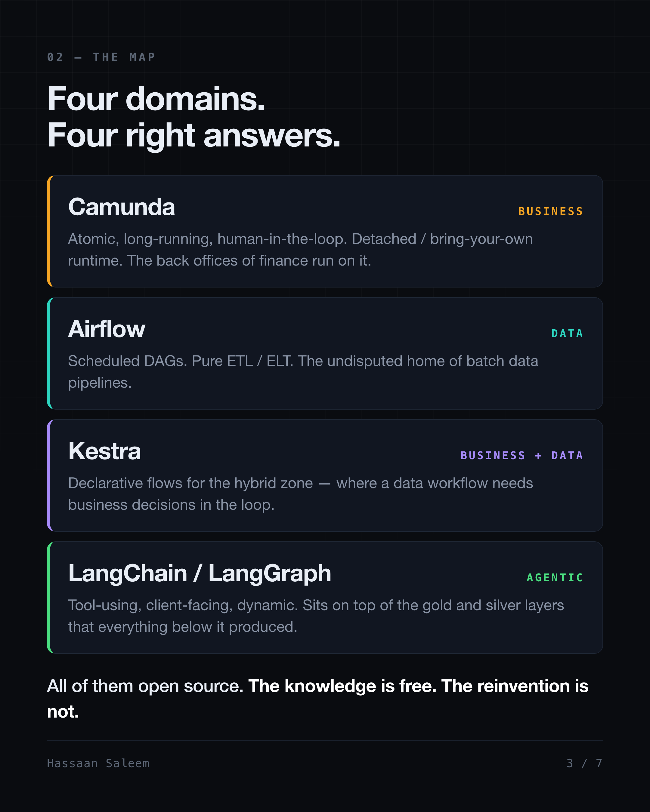
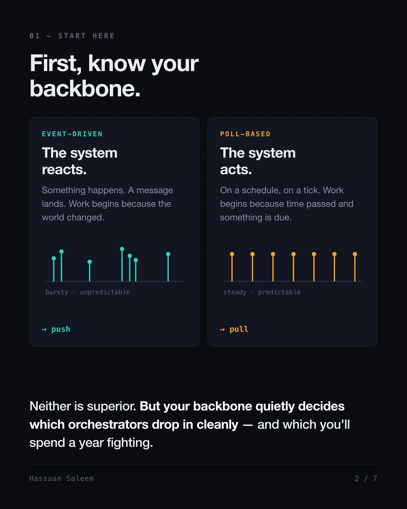
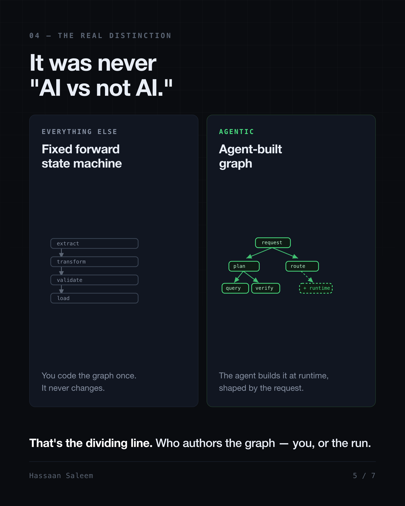
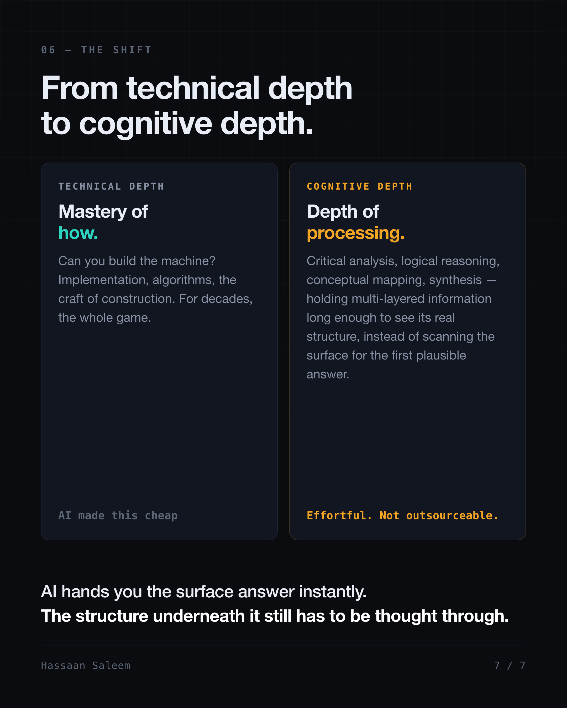

# Orchestrators: The Backbone, the Line, and the Bill

*What I learned putting real workloads on engines that quietly disagree about what "work" even is.*

Choosing an orchestrator is choosing a category, and there are four:

- **Business process — Camunda (BPMN).** The unit of work is a process. The hard part is time and people.
- **Data ETL/ELT — Airflow.** The unit of work is a dataset. The hard part is blast radius.
- **Business plus data — Kestra.** Pipelines with business decisions wired through the middle. Not pure ETL, not pure approval flow.
- **Agentic — LangChain / LangGraph.** If deciding what to do next is itself part of the work, no author can write the graph in advance.

This is a field report from three of them.

Written down, the list looks obvious. In a room it never is, because the tests people reach for are the wrong ones. "Is a human involved" is not the Camunda test — a human clicking approve inside an ETL DAG is not a business process. The sharp test is whether the run *suspends* mid-execution, waits on a person for three days, and *resumes*. A refund approval idles in someone's inbox over a long weekend, and the failure mode is not a crash; it is a process stranded halfway with real-world side effects already committed. Which is why the response to failure inverts: you don't retry a refund you already issued, you reverse it. Compensation, not retry. Data tools model this badly, and the usual explanation is wrong — it isn't that a sleeping task holds a worker slot, because deferrable operators and reschedule-mode sensors free it. It's that task inboxes, assignment, escalation, multi-week durable state and a compliance-readable audit trail are not primitives those engines have. Finance back offices live there, and a detached, bring-your-own runtime is a genuine strength in that world rather than deployment trivia. Move to datasets and every one of those assumptions relaxes: steps are idempotent and re-runnable, so failure is survivable — as long as one bad input doesn't take everything down with it. The categories don't mark what's possible. They mark where an engine's primitives stop needing to be worked around.

## The Backbone

Upstream of the category, though, sits the thing that decides which tools can even drop in cleanly: how work starts.

There are two answers. Event-driven — work starts because something happened. Poll-based — work starts because a clock said so, or because a loop found something waiting. Neither is superior. An orchestrator is fundamentally **an opinion about when work starts**, and that opinion has to match the system it is landing in.

Force a scheduled DAG engine onto a reactive system and you spend your life writing sensors — tasks whose only job is to wait for something that already announced itself. Force a reactive engine onto batch ETL and you spend your life manufacturing fake events to trigger work a cron line would have started for free. Neither is a bug. Both are a mismatch. And the backbone only narrows the tools that fit; it does not pick the category. Half of all orchestrator disagreements are two people describing different backbones and believing they are arguing about tools.

The two bridge deliberately, if you want them to. On the Kestra side I ran a JDBC trigger polling a Postgres queue table every one to five minutes, sitting alongside ordinary cron schedules — claiming rows inside a transaction that selects `FOR UPDATE SKIP LOCKED`, so a poller skips the rows another transaction holds instead of blocking on them, updates a status column, commits. Two pollers never claim the same row and never wait on each other. `SKIP LOCKED` is the concurrency mechanism; the status update is the claim. That is not the low-latency design and was never meant to be — a claim table is boring, observable and replayable, and a lost broker message is none of those three. The trade is latency for inspectability, and the reason to name a trade out loud is so nobody later mistakes it for an accident.

## The Line

The backbone narrows the field. It doesn't draw the real line.

Call that line what it is — **authorship**: who writes the topology, and when. Camunda, Airflow and Kestra all execute a graph a human wrote before the run started, and that shared property outweighs every feature they don't share.

Airflow's dynamic task mapping looks like the counterexample and isn't. `.expand()` changes how *wide* the graph is, never what *shape* it is. Cardinality is data-determined; topology is not. Fan out to three tenants or three hundred and you still have the same nodes, in the same order, with the same edges. Two objections land and neither breaks the rule: DAG files are Python evaluated at parse time, so structure can vary between parses, and `BranchPythonOperator` picks a path at run time. But for a *given run*, the node set and the edges are fixed before that run begins. `.expand()` decides how many instances of an already-declared node exist; branching selects among already-declared paths.

That constraint is not bookkeeping. It is the thing that lets you reason about failure at all: you can point at a node and say what happens when it dies, because the node existed before the run did. Alerting, ownership, runbooks, blast radius — all of it assumes a graph you can read while nothing is running.

A planner breaks that. I built one — six stages (validate and classify intent, plan a task DAG, select a model or agent per task, execute, respond, validate), each stage handler an LCEL chain, a `PromptTemplate` piped into a runnable model on `ChatBedrock`. The *generated* graph then runs through a Kahn topological sort into dependency batches, executed concurrently under an `asyncio.Semaphore`, with an agent-as-provider factory routing each task to a specialist — a pandas data analyst, a web research agent with search and scraper tools, a conversational agent, a qualitative narrative agent — or to a data API. Pipeline state checkpoints per stage to Postgres so a session resumes mid-pipeline, and the state trees are recursive, because one analysis can spawn child analyses. Nothing in that topology existed before the run. Topology had stopped being an input to execution and become an output of it, and every guarantee that depended on knowing the graph in advance had to be rebuilt by hand. The checkpointing, the concurrency bound, the resume semantics were not features. They were the price of admission.

State LangGraph's case at its strongest, because understating it weakens the argument. Conditional edges route at run time. `Send` fans out at run time. `Command(goto=...)` redirects at run time. Checkpointers resume from a node, and subgraphs nest. What it does not do is let a planner invent nodes that were never declared — the same width-not-shape invariant as `.expand()`, one layer up. And the obvious objection is real: nothing stops you compiling a fresh `StateGraph` inside a node at run time. That is the rule rather than the exception to it, though, because the guarantee was always per compiled graph. Compile a new one mid-run and you are the planner; the runtime's guarantees stop at that boundary, and the failure and resume semantics on the far side of it are yours.

Which is exactly why the line is about authorship and not about AI. An entirely LLM-powered system whose graph is fixed in YAML belongs on the declared side — those Kestra flows call LLMs from native AI agent tasks sitting in the same declarative file as the JDBC and HTTP tasks, and the graph never moves. A non-AI planner emitting task graphs from a solver belongs on the other side. It is not AI versus not-AI. It is declared versus generated.

One conflation worth naming while we're here: LCEL is a **composition** library. It composes handlers. A system can use LCEL for every stage handler and still need a separate runtime to sequence those stages, checkpoint them and recover them. Comparing a composition library to an orchestrator is comparing a function-call convention to a scheduler.

## The Bill

Knowing which side of the line you're on still doesn't tell you who should build the thing.

Here is what a mature engine actually bought across ~28 DAGs in 13 families on CeleryExecutor — three workers, Redis broker, Postgres result backend:

- **Dynamic task mapping** for per-tenant fan-out, so one tenant's bad payload fails its own mapped task and blocks nobody else
- **Watermark and per-day checkpointing**, so incremental ingestion resumes — which matters exactly once, the night a backfill dies at hour nine
- **Custom pools**, so an ML training job with a 24-hour timeout cannot starve the ingestion lane

Call that list what it is — **containment**. Isolate failure, checkpoint progress, bound concurrency. None of it is clever code. It's the accumulated shape of things that went wrong once, to someone, and got fixed upstream. So is everything else that earned its keep and never appears in a tutorial: MLflow for tracking and registry with per-tenant models and production alias rotation; headless Chromium inside Celery workers rendering session recordings to video; on the Kestra side, a dozen declarative flows across four namespaces GitOps-deployed with git as the source of truth and flows upserted over REST on push, `ForEach` subflows under a `concurrencyLimit`, and a flow-level `MAX_DURATION` SLA backstopping hung runs, because something eventually hangs. You're not buying features. You're buying other people's outages.

Those two deployments reached opposite conclusions about state, and both were right. The Airflow box was stateful by design — on-box Postgres and Redis, `prevent_destroy` on the resources, paid for in operational care. The Kestra deployment inverted it: stateless by design, all state pushed off-box to managed Postgres and S3 so the compute node stays disposable. Run a stateful engine on ephemeral infrastructure, or a stateless one with local-disk assumptions, and you get failures that look like bugs and are actually mismatches. Evaluate the contract, not the noun.

Which leaves building your own defensible for exactly one thing: a capability *combination* you cannot get without rebuilding around someone else's state model — a topology generated mid-run from intermediate results, **and** recursive state trees where one analysis spawns children. Either alone is buyable. Only both together clear the bar. Assume buy; make build clear the bar. So I put my own orchestrator on trial rather than assume it had cleared it. Mastra: do not migrate — a full cross-language rewrite, the pandas analyst agent a hard blocker in JS, framework immaturity on top. LangGraph: selective adoption only, do not full rewrite — genuinely good engineering that solved no problem the system actually had, against a codebase production-stable with 178 tests and 95% coverage standing behind any change. "Good engineering" is not a reason to migrate; a framework that solves no problem your system has is a rewrite with no numerator. And cross-language rewrites carry blockers that framework maturity does not offset. The question is never "is this tool good." It is "does this tool solve a problem this system actually has." The conclusion was not "always buy."

The build case sounds most reasonable in event-driven microservices, where half the machinery already exists — a broker, consumers, retries — and what's left is "just" a state machine. A competent team can write one in a sprint, and the estimate is usually correct. It just covers the wrong thing. Build cost was never the expensive part; maintenance, scalability and reliability are, and the estimate never covers the next three years. AI writes the code now. It does not carry the pager.

One honest caveat, because the debate deserves it: buying isn't free either. A mature engine is a dependency with its own operational surface, its own upgrade path, its own state model you now live inside. Plenty of teams have drowned in an orchestrator they adopted for four nightly jobs that a cron line and a claim table would have handled for years. The default should be buy — but the smallest honest answer is sometimes neither.

Step back from the orchestrator, though, because the pattern is bigger than scheduling. Technical depth is mastery of *how* — implementation, algorithms, the craft of construction. For decades that was the whole game, and AI made it abundant and cheap.

**Cognitive depth** is a different faculty entirely. It is the capacity to hold complex, multi-layered information and actually process it — critical analysis, logical reasoning, conceptual mapping, synthesis — rather than surface-scanning until something plausible appears. It is effortful by construction. That effort is what makes it depth.

And it is exactly what the build decision skips. "We have a broker, we have consumers, we have retries, so what's left is just a state machine" is surface scanning: pattern-matching on the components sitting in front of you. Recognising that the thing you are about to write is structurally the same problem four mature engines already solved, that the cost lands in year three rather than sprint two, and that your backbone quietly disqualified half the field before anyone opened a comparison table — that is conceptual mapping, and no model does it on your behalf.

Every engine named here is open source. The knowledge is free, and only the reinvention is expensive. Most build-versus-buy calls go wrong long before anyone compares anything, because nobody in the room knows what already exists — and nobody thought a layer past the first plausible answer.

The backbone is priced in sensors. The line is priced in guarantees. The bill is priced in years — and of the three, only the knowing got cheap. The thinking didn't.

---

*Tools named: Camunda, Airflow, Kestra, LangChain, LangGraph, MLflow. Companion piece: [Agentic Coding: The Delta, the Loop, and the Learning](agentic-coding-the-delta-the-loop-and-the-learning.md).*
