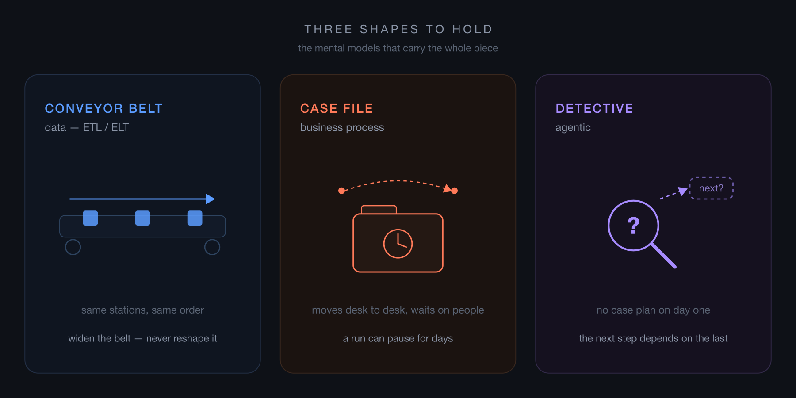

# Orchestrators: Business, Data and AI

### Four engines, one question nobody asks, and how to tell which orchestrator your problem actually needs

*Hassaan · Disrupt · August 2026*

---

Orchestration is one of the most misunderstood topics in engineering — not the hardest, the most misunderstood. And AI has only raised the stakes: someone now has to coordinate the agents everyone is suddenly building.

I have heard the same sentence in more design reviews than I can count.

> "We already have a queue, a worker and a retry. What's left is basically a state machine."

And the estimate attached to it is usually right. A competent team really can write that state machine in a sprint, and the room agrees it's a week of work.

The estimate isn't the problem. The problem is what it quietly leaves out — because a state machine is cheap to *write* and expensive to *own*, and the sprint estimate only ever prices the writing.

I've watched two good engineers argue tools for an hour before realising they were describing different problems — then go build the engine themselves anyway, because AI made the code free to write. Everything that happens *after* the code did not.

So let me be literal, because the marketing never is. **An orchestrator is a runtime that manages a runtime.** You have work that happens in steps, and if you can describe those steps — state machine, graph, checklist, whatever you call it — the orchestrator owns that graph and does three jobs with it. It *executes*: the right steps, in the right order, in the right place. It *manages*: retries failures, holds state between steps, resumes after a crash, bounds how much runs at once. And it *governs*: shows you what ran, what it produced, who approved it, and what broke.

That third job is the one people forget, and it's the reason orchestrators exist as products instead of as a file in your repo. Executing steps is easy. Executing steps *and still being able to answer questions about a run that happened three weeks ago* is not. Hold onto that — it's exactly the part the sprint estimate leaves out.

Here's what surprised me when it clicked: every kind of orchestrator does those same three jobs. They agree on almost everything. What they disagree about is narrow — and that narrow disagreement is the whole article. Because choosing one isn't choosing a tool; it's choosing a *category*, and there are four. Get the category wrong and no amount of configuration digs you out.

| Category         | Engine                | The unit of work                | The hard part               |
| ---------------- | --------------------- | ------------------------------- | --------------------------- |
| Business process | Camunda (BPMN)        | one process instance            | time, and people            |
| Data ETL/ELT     | Airflow               | a dataset                       | blast radius                |
| Business + data  | Kestra                | a pipeline with decisions in it | who is allowed to write one |
| Agentic          | LangChain / LangGraph | a goal                          | the plan doesn't exist yet  |

One honest note before those names carry any weight: each engine in the table is simply one I've worked with, not the only one that fits its row. There are many alternatives in every category — Temporal, Prefect, Dagster, n8n and CrewAI among them — and I'm naming specific tools only to make each category concrete, not to recommend one over its rivals.

Before the names mean anything, though, I want to hand you three pictures, because they're easier to hold than the table and they carry all the way down.

Data work is a **conveyor belt**. Same stations, same order, every single night. When there's more to process you widen the belt — but the stations don't move and the order doesn't change.

Business process is a **case file**. It moves from desk to desk, and sometimes it just sits in someone's inbox over a long weekend, waiting for a person who isn't in yet.

Agentic work is a **detective**. There's no case plan on day one. What comes back from the third interview decides whether there's a fourth one at all.

Hold those three, because the shapes don't swap. Put a detective on a conveyor belt and the process stops being deterministic — he stops to reason about every item that comes past, but a belt only works if each one is treated the same. Run it the other way, clamp a fixed belt over detective work, and you've demanded the case be solved before the first interview is even done.

---

## Business process — the case file

The unit of work here is one process. One refund. One onboarding. One insurance claim.

And the hard part isn't compute. It's time, and people.

There's one question that identifies this category cleanly: *does a run suspend in the middle, wait on a human for three days, and then pick up exactly where it left off?* If yes, you're here.

A pause for a person isn't quite the whole test, though — an agent can wait on a human too, to approve a plan or clear an action mid-run. What settles it is whether the workflow is deterministic. In a business process the graph is fixed before the run starts, and the human is a required input at a known step. In an agent the graph is generated as the run goes, so the pause sits inside a shape the run is still inventing.

Picture the refund approval sitting in someone's inbox over that long weekend. Nothing is running. Nothing has crashed. The process is simply *paused*, halfway through, with real-world side effects already committed — money moved, an email sent, a record changed at a partner you don't control. That's the failure mode that defines the category — not a crash, but a pause you can't take back.

Which changes how you think about failure. You do not retry a refund you already issued — you reverse it. BPMN, the modelling language Camunda runs on, has this built in as a first-class idea: compensation, not retry. It's there because the people who designed BPMN were modelling banks and insurers, not batch jobs. When a step can't just be run again, undoing has to be part of the language, not something you bolt on later.

Camunda adds one more choice that matters enormously in regulated work: you decide where the engine lives. Run it as a shared remote cluster, or self-manage it inside your own boundary so the process state never leaves your walls. Or both — a managed control plane, with the actual tasks pinned in your own environment. Its underlying engine, Zeebe, is built for exactly that split: custom runtimes keep the steps that have to run on your side of the line right there. That sounds like a footnote until you're in a room where a process is *legally required* to be auditable and a human signature is a real node in the graph. Then it's the whole reason the tool is on the shortlist — and it's why Camunda's case studies read like a roster of banks, insurers, telcos and government bodies.

The tell here is easy to catch. If someone describing the flow says "and then it waits for approval," and that wait can last days, and a human is the reason — you're in business process. Stop shopping in the data aisle.

---

## Data — the conveyor belt

The unit of work is a dataset. And the hard part is blast radius: one bad input must not take down the other forty.

This is the category everyone already knows, because it's the one with a default answer — Airflow, usually next to a model registry for the ML side and dbt or stored procedures for the transformations. But run enough of it in production and you learn you weren't paying for the scheduler. You were paying for three primitives that only show their worth on a bad night.

The first is **dynamic task mapping**. One task declaration fans out at run time into one task per tenant. A single tenant ships a malformed payload, that one tenant's task fails, and every other tenant finishes clean. Write it yourself as a loop instead, and the loop dies on the first bad row and takes the good rows down with it.

The second is **watermarks and checkpointing** — incremental jobs recording how far they got. This one earns its keep exactly once: the night a nine-hour backfill dies at hour eight. On that night it is worth more than every feature above it combined, and every other night you forget it's there.

The third is **pools** — a pool is just a semaphore with a name. Give heavy rendering its own pool and a model-training job with a day-long timeout can never starve the ingestion lane. Two workloads, one cluster, no negotiation between them.

Look at those three together and you can name what they actually are: *containment*. Isolate failure, checkpoint progress, bound concurrency. None of it is clever code. It's the accumulated shape of things that went wrong once, to somebody else, years ago, and got fixed upstream so you'd never have to have that outage yourself. That's the real product.

Containment has a companion lesson, learned later and usually the hard way: push the compute *down*. If the data is too big to sit comfortably in process memory, the orchestrator has no business holding it. Move the logic to where the data already lives — dbt models, stored procedures, warehouse SQL — and let the orchestrator move pointers instead of payloads.

So when you adopt something like Airflow, you're not really buying features. You're buying other people's outages, already survived.

---

## Business plus data — the belt with a stamp in the middle

Then there's the awkward middle, and it turns out to be more common than either pure case: pipelines that are mostly data movement but have real business decisions wired through them. Not clean ETL. Not a clean approval flow. Something in between that neither aisle quite fits.

Kestra is built for that seam, and its real differentiator isn't a feature you can point at on a comparison table — it's *authorship*. The flows are declarative YAML, which means the person who understands the business rule can write the flow without also being the person who understands the runtime. Which is the whole thing: the difference between the analyst waiting two sprints for an engineer and the analyst shipping the flow herself on a Tuesday.

Set authorship aside for a moment and look at the pipelines themselves — they tend to keep one signature shape, and once you see it you see it everywhere:

**Data in. An agent in the middle. A process out the other side.**

Let me put that shape on a concrete job. Take a retailer selling across three marketplaces. Every night, new customer reviews pile up across all three.

The first stretch of the flow is pure data work — pull the new reviews from each marketplace, match each one to the product it belongs to, line them all up. Plain tasks, no intelligence involved. Fetching and matching is *transport*, and transport doesn't need judgment.

Then the agent takes its turn, and it gets exactly one job: read each review and decide what it's actually saying. "The zipper broke in a week" is a defect. "Runs small, order a size up" is a sizing issue. "Arrived late" is a delivery complaint — about the courier, not the product. Telling those three apart is genuine judgment, the one step in the whole flow that code can't do reliably. So that's the one step the model gets — judgment, and only judgment.

Everything after that decision is process, and process runs on business rules, not on model output. Defect reports open a case with the supplier. Sizing complaints — once enough of them agree — update the product page. Delivery complaints route to logistics, not to the product team. And a product a category manager has flagged for manual handling skips the automation entirely, no matter what the model concluded about it.

And notice who owns those rules. "Once enough agree" is a number someone has to choose — five reviews, or eight — and that someone is the category manager, not an engineer. Thresholds move, categories get added, routing changes: business decisions, tuned constantly by the people who own the outcome. That's the real reason the awkward middle resists a pure-code tool. Write it as an Airflow DAG and every parameter lives in Python. Letting an AI write that DAG doesn't help either — the parameters still sit in code, where a subject-matter expert can't reach or test them. Each tweak becomes a developer ticket and a deploy. The hybrid tools earn their place by handing that person a knob she can turn herself, instead of locking it behind code.

The run fans out over the products a few at a time, each one allowed to fail on its own — one marketplace's API going down at midnight must not strand the other two. And notice that the agent's verdict is treated as a *proposal*, never as an action. The flow decides what happens. The agent only decides what's true.

The tell here: the flow has a model call, a database write and a decision step all living together, and nobody in the org can quite decide which team owns it. That's not a problem with the flow. That *is* the category.

---

## Agentic — the detective

Now the detective — the one category that breaks the pattern the other three share.

In the first three, a human wrote the graph before the run ever started. Here, the graph is an *output* of the run, not an input to it. Nobody drew it in advance because nobody could — the shape of the work only becomes knowable once the work is underway.

The typical build looks reasonable enough on paper. A stage that validates and classifies the incoming request. A stage that plans a task graph. A stage that assigns a model or a specialist agent to each task. Then execute, respond, validate. Each of those stage handlers is a composed chain — a prompt template piped into a model call.

One clarification, because it wastes a lot of people's time right here: LCEL — the LangChain composition syntax — is a composition library. It composes handlers. You can use it for every stage and still need a separate runtime to sequence those stages, checkpoint them, and recover them when they break. Comparing it to an orchestrator is comparing a function-call convention to a scheduler — not the same layer. Conflating them is how people end up convinced they already have an orchestrator when what they have is a nicer way to write functions.

That separate runtime is where it gets interesting. The graph the planner produced gets topologically sorted into dependency batches, then run concurrently under a bounded semaphore. A factory routes each task to whichever specialist fits — a data analyst, a web researcher with search and scraper tools, a conversational agent, or sometimes just a straight read against an API. State checkpoints after every stage so a session can resume from the middle. And the state trees are recursive, because one analysis can spawn child analyses of its own.

Read that list back, because it's the lesson of this whole part: *none of it is a feature you were handed.* Checkpointing, the concurrency bound, resume semantics, per-task isolation — in the data and hybrid categories every one came in the box. Here you write all of them yourself. The moment the topology stopped being knowable in advance, every guarantee that depended on knowing it had to be rebuilt by hand. That's the real price of admission — not the model calls, which are the easy part, but the plumbing you stop getting for free.

Zoom out from the plumbing, though, because the detective is really here to reveal the line that sorts the entire field — and it's not on any comparison table. It's a single question: **who writes the graph?** Camunda, Airflow and Kestra all sit on the declared side, and that one shared property outweighs every feature they don't share.

Dynamic fan-out looks like the counterexample, and it isn't. Fanning out changes how *wide* the graph is, never what *shape* it is — three tenants or three hundred, it's the same nodes and the same edges, just more copies of them. Even LangGraph at its most capable — conditional edges, runtime fan-out, checkpointed resume — never lets a planner invent a node that wasn't declared somewhere. The moment you compile a fresh graph mid-run from intermediate results, *you* have become the planner, and every guarantee past that boundary is yours to write.

That declared constraint isn't bookkeeping. It's what lets you reason about failure at all. You can point at a node and say what happens when it dies, precisely because the node existed before the run did. Alerting, ownership, runbooks — all of it quietly assumes a graph you can read while nothing is running. Take that away and you don't just lose a diagram; you lose the ability to answer "what breaks if this step fails" before it fails.

And notice what the line actually tracks. A flow that is fully LLM-powered but fixed in YAML is declared. A solver that emits fresh graphs — with no AI in it anywhere — is generated. It was never AI-versus-not-AI. It was always who-holds-the-pen.

---

That's the field's sharpest sorting tool — and it has a twin that cuts as deep: **when does work start?**

Event-driven, because something happened; or poll-based, because a clock ticked. An orchestrator is, at bottom, an opinion about when work starts, and it has to match the system it lands in. Put a scheduled engine on a reactive system and you write sensors that wait for events that already fired; put a reactive engine on batch ETL and you manufacture fake events a cron line would have triggered for free. Neither is a bug — both are a mismatch.

Half the orchestrator arguments I've sat through were two people describing different backbones while thinking they argued about tools. And both questions — who writes the graph, and when work starts — are exactly what "we'll just build it" skips.

The build case is most tempting in event-driven microservices, where a broker, consumers and retries already exist and what's left looks like "just" a state machine. The estimate is usually right — it only ever prices the writing, never the owning. AI writes the code faster than ever; it still doesn't carry the pager at 3am. I've watched it fail both ways: a product trapped in a low-code tool the day it needed a real test suite, and hand-rolled services that rebuilt retries, scheduling and state four times before anyone noticed it was one problem. Both skipped the question that sorts it — *does this already have a mature engine, and what would adopting it cost?*

So: assume adopt, and make build earn its place. It earns it for one thing — a *combination*: a topology generated mid-run, *and* recursive, resumable state where one unit of work spawns children. You can't buy that pairing without rebuilding around someone else's state model. Either alone is off the shelf. And the test is never "is this tool good" — plenty of good ones solve no problem you have — but *does it solve a problem this system actually has?* Adopting isn't free either, so the smallest honest answer is sometimes *neither*.

Every engine here is open source — documented and battle-tested, hardened by everyone who ran into the hard parts before you did. The knowledge is free; only the reinvention is expensive. Most build-versus-adopt calls are lost before anyone compares anything — because nobody knew what already existed, and nobody thought one layer past the first answer that sounded right.

