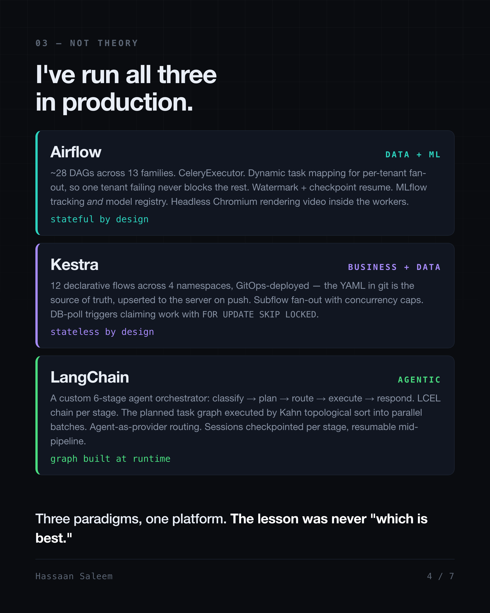

# Orchestrators: Business vs Data vs AI

*Three engines in production, and the build-versus-buy judgment behind them.*

A Kestra JDBC trigger polls a Postgres queue table every one to five minutes and claims rows with `FOR UPDATE SKIP LOCKED`. A flow wakes up and runs business logic. Elsewhere in the same stack, an Airflow DAG fans out per tenant with `.expand()` on a schedule that has not moved in months. Above both, an agent decides at runtime what its own task graph should be, then executes it.

Three orchestrators. None of them interchangeable. It took building all three to understand why.

I keep a decision log because of a review I once sat in where someone proposed building an orchestrator. Not adopting one. Building one. In an event-driven microservice architecture that always sounds reasonable at first, because half of it already exists: you have a broker, you have consumers, you have retries. What's left is "just" a state machine. Somebody estimated the build. Nobody estimated the next three years.

Below is the honest version of my log, across three engines I have actually run in production, plus the one I put on trial.

## Decision 0: Know your backbone before you shop

Every orchestrator conversation starts in the wrong place. People argue tools before they've named their backbone.

Two options. Event-driven: the system reacts. Poll-based: the system acts, predictably, on a clock. Neither is superior, and anyone selling you one as universally correct is selling you something. But the backbone quietly constrains which orchestrators drop in cleanly, because an orchestrator is fundamentally an opinion about *when work starts*. Force a scheduled DAG engine onto a purely reactive system and you spend your life writing sensors. Force a reactive engine onto batch ETL and you spend your life writing fake events.

I've run both, sometimes in the same platform. My Kestra triggers poll a claim table on an interval and sit next to cron schedules. That is poll-based logic in front of an event-shaped workload, on purpose, because a claim table is boring, observable and replayable, and a lost message is none of those. That was a judgment call, not a framework default.

## Decision 1: Airflow, where the job is blast radius

The data platform runs about 28 DAGs across 13 families on CeleryExecutor: three workers, Redis as broker, Postgres as result backend.

The parts that earned their keep were not the parts in the tutorials. Dynamic task mapping via `.expand()` gives per-tenant fan-out, so one tenant's bad payload fails its own mapped task and never blocks the other tenants' work. Watermark and per-day checkpointing makes incremental ingestion resumable, which matters when a backfill dies at hour nine. Custom pools cap concurrency so an ML training job with a 24-hour execution timeout doesn't starve the ingestion lane. MLflow covers experiment tracking and the registry, with per-tenant registered models and production alias rotation. We even ran headless Chromium inside Celery workers to render session recordings into video, which is exactly the kind of thing you only attempt on an engine you didn't write.

Look at what nearly all of that is: containment. Isolate failure, checkpoint progress, bound concurrency. None of it is clever code. All of it is scar tissue.

The unglamorous part: this box is stateful by design. On-box Postgres and Redis, `prevent_destroy` on the resources. I chose that, and I pay for it in operational care.

## Decision 2: Kestra, where state placement *is* the architecture

Then came the workflows that were data pipelines with business decisions wired through the middle. Not pure ETL. Not pure approval flow. Both.

Twelve declarative YAML flows across four namespaces, GitOps deployed, meaning git is the source of truth and flows are upserted to the server over REST on push. Subflows with `ForEach` and a `concurrencyLimit` for per-item fan-out, parallel and sequential topologies, JDBC Postgres tasks, HTTP tasks, JS eval tasks, and native AI agent tasks calling LLMs directly inside a declarative flow. A flow-level `MAX_DURATION` SLA as the backstop against hung runs, because something always hangs eventually.

The deliberate inversion from Airflow: this deployment is stateless by design. All state pushed off-box to managed Postgres and S3, so the compute node is disposable. Two orchestrators, two opposite storage verdicts, both correct for their workload. Same word, "orchestrator". Completely different operational contract.

## The map, compressed

| Domain | Tool | Who authors the topology |
|---|---|---|
| Business workflows | Camunda | Human, ahead of execution |
| Data ETL/ELT | Airflow | Human, ahead of execution |
| Business + data hybrid | Kestra | Human, ahead of execution |
| Agentic | LangChain / LangGraph | Human declares nodes; a planner can emit the graph mid-run |

What that table hides is how differently these want to be operated, and one boundary I should mark: Camunda is the row I have read and evaluated rather than run. It owns atomic, long-running, human-in-the-loop work with a detached or bring-your-own runtime, which is why finance back offices live there.

The structural line that actually matters isn't AI versus not-AI. It's *who authors the topology, and when*. Camunda, Airflow and Kestra all take a graph a human wrote ahead of execution. Airflow's dynamic task mapping is not a counterexample: `.expand()` changes how **wide** the graph is, never what **shape** it is. Cardinality is data-determined; topology is not. That constraint is a feature, because it's why you can reason about failure.

A planner changes the shape. The topology becomes an output, not an input.

## Decision 3: the one I built anyway

The agentic layer is a custom multi-stage orchestrator on LangChain, six stages: validate and classify intent, plan a task DAG, select a model or agent per task, execute, respond, validate. Every stage handler is an LCEL chain, a `PromptTemplate` piped into a runnable LLM on `langchain-aws` ChatBedrock. Execution runs the generated graph through a Kahn topological sort into dependency batches, concurrent under an `asyncio.Semaphore`. An agent-as-provider factory routes each task to a specialized agent: a pandas data analyst, a web research agent with search and scraper tools, a conversational agent, a qualitative narrative agent, or straight to a data API. Pipeline state checkpoints per stage to Postgres, so a session can short-circuit and resume mid-pipeline. State trees are recursive, because an analysis can spawn child analyses.

Note the layering, because the evaluation depends on it: LCEL is a composition library and it composes my stage handlers. The orchestration runtime is mine. Those are different jobs, and conflating them is how people end up comparing the wrong things.

Then I put it on trial, because building your own orchestrator is the most seductive mistake in this industry and I wanted to know whether I had made it.

**Mastra: Do Not Migrate.** Full language rewrite risk, and the pandas analyst agent was a hard blocker in JS. Framework immaturity on top.

**LangGraph: Selective Adoption Only, Do Not Full Rewrite.** It is a genuinely good piece of engineering, and it solved no problem I actually had. The system was production-stable, with 178 tests and 95% coverage standing behind any change I needed to make. Adopt patterns, not a rewrite.

Note what I did not conclude. I did not conclude "always buy." The custom system survived review because of a combination I could not get cleanly without rebuilding around someone else's state model: a topology generated mid-run from intermediate results, plus recursive state trees where one analysis spawns children. LangGraph checkpointers resume from a node and subgraphs nest; what LangGraph does not do is let the planner invent nodes that were never declared. That is the whole reason it solved nothing for me, and it's also why the category line is about authorship rather than about AI.

That is a real answer to "why are we building this," and it is the only acceptable one. Know exactly why you are building, then re-examine that reason honestly, on a schedule, fully willing to lose the argument.

## What the log is actually for

Every tool above is open source. The knowledge is free. Only the reinvention is expensive. Most build-versus-buy calls go wrong long before anyone compares anything, because nobody in the room knows what already exists.

Technical depth is mastery of *how*. Can you build the machine? Implementation, algorithms, the craft of construction. For decades that was the whole game and the primary differentiator. AI made it abundant and cheap. Cognitive depth is mastery of *what* and *why*. Which tool fits this workload, what ownership costs in year three, what breaks at 10x, when not to build at all. It's knowing the shape of a problem well enough to recognize which already-solved problem it is.

AI collapsed the cost of building. It did not collapse the cost of owning.

So if you're reaching for a custom orchestrator this quarter, the first question isn't whether you can build it. It's whether you'd still choose to own it now that the code writes itself for free.
