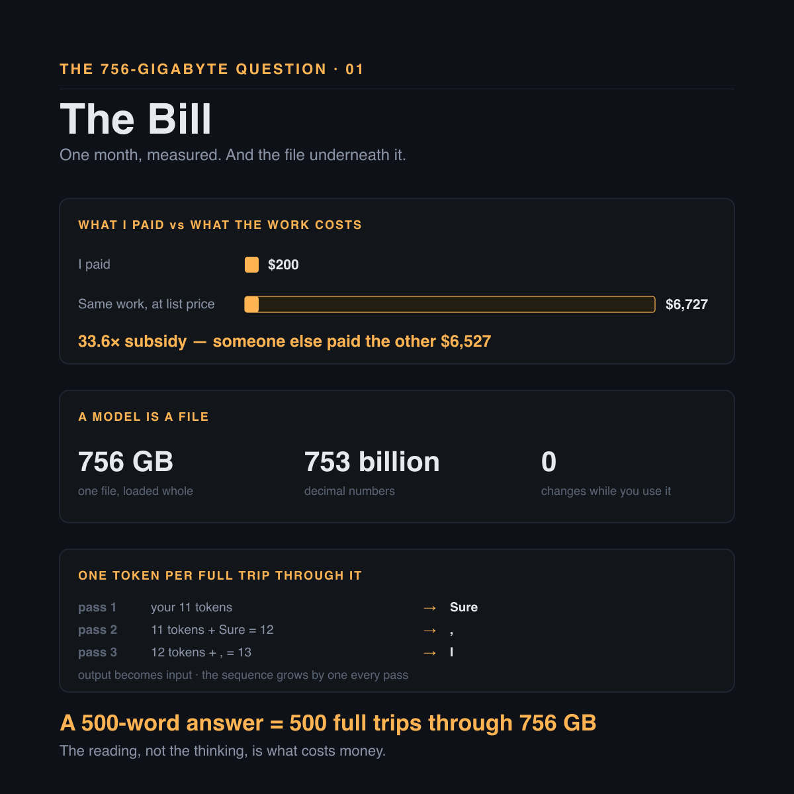
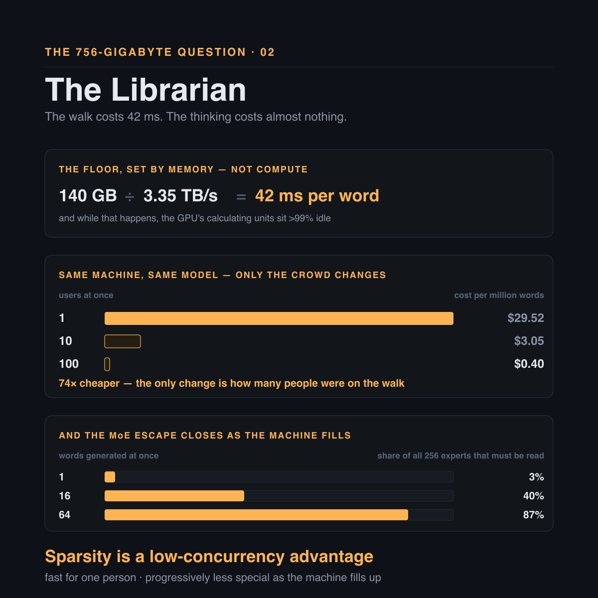

# The 756-Gigabyte Question

### The models are free now — so why does anyone still pay for an API?

*Hassaan · Disrupt · September 2026*

---

I pay $200 a month for Claude. In July I measured what I actually used: 8.2 billion tokens of input, 41.7 million of output. At list price for Opus 4.8 — cache reads and writes included — that same work costs $6,727.

I paid $200. Someone else paid the other $6,527.

That is a 33.6× subsidy, and once you have seen a number like that you cannot unsee it. It asks one obvious question, and the obvious question turns out to have a very long answer.

**Could I just run the model myself?**

The models are free now. DeepSeek, Z.ai, Moonshot, MiniMax — frontier-class weights under MIT licenses. You can download them. Nobody stops you. So what exactly stops anyone renting a machine, loading a model onto it, and cutting the middleman out?

Three weeks of research later I have the answer, and almost none of it was where I expected it to be. What follows is the whole walk down — no prior knowledge assumed, and I will be literal about everything, because every place this argument goes wrong is a place where a metaphor was doing too much work.

The answer is no. The interesting part is the reason, and nobody guesses it: **the cost of AI is not thinking, it is fetching.** Follow the fetching all the way to the bottom and the leverage turns out to be sitting one layer up from where everybody is looking.

## A model is a file

Start with the least glamorous fact in artificial intelligence.

**A model is a file.** GLM-5.2, one of the best open models available today, is 756 gigabytes. Not a program. Not a database. Not a brain. A very large spreadsheet of 753 billion decimal numbers, nudged one at a time over months of training until the whole arrangement happened to be good at predicting what word comes next. Nobody knows what any individual number means. Nobody chose them. They are the residue of the training process.

And the file does not change while you use it. Not when you ask a question, not when you get an answer, not ever. It does not learn from your conversation. It does not remember you. It is a fixed, frozen, read-only lump of 756 gigabytes.

Everything that feels like intelligence is arithmetic against that file.

Which brings me to the part almost everyone misses. The model can only ever do one thing: given a sequence, predict the token that comes next. One token, per full trip through all 78 of its layers. That is the entire trick.

So how do you get a paragraph out of it? You append the model's own word to your sentence and run the whole thing again. Its output becomes its own input; the sequence grows by one on every pass.

> A 500-word answer is 500 separate full trips through 756 gigabytes.

That is why an answer types itself onto your screen one word at a time instead of arriving all at once. You are watching the loop run.

Hold onto that, because it is the most expensive fact in this piece. On every one of those 500 trips the machine has to read the model. All of it. And the reading, not the thinking, is where the money goes.

*What one month of usage actually cost, and the two facts everything else rests on.*

## The librarian's walk

To produce one word, the GPU has to read the model's weights. Not some of them — for a dense model, all of them. Every word, every time.

Do it on a smaller model so the numbers stay friendly. Llama-70B is 140 GB; a top-end H100 reads its own memory at about 3.35 TB/s.

`140 GB ÷ 3.35 TB/s = 42 milliseconds`

**42 milliseconds per word. Minimum.** About 24 words a second, and that is a property of the hardware rather than a bug in the software. Meanwhile the GPU's calculating units — the expensive part, the part the marketing is about — sit more than 99% idle, finishing their sums instantly and waiting for the next numbers to arrive.

"But surely you only load the model once?" Right objection, and it deserves a proper answer, because **loading and reading are two different things.**

The weights load once, at startup, and stay in GPU memory. But the chip cannot do arithmetic on data sitting in memory. Every number has to move onto the chip first, and the chip's scratch space is about 50 MB against a 140 GB model — a ratio of 2,800×. So it streams through in slabs: pull, multiply, discard, pull the next. By the time it reaches layer 78, layer 1's weights were flushed long ago. Next word, stream all of them again.

Picture a librarian in a library of 140,000 books. To answer any question at all he walks past every shelf. The walk takes 42 seconds. The thinking, once he has walked, takes half a second.

That is the model producing one word.

## The crowd on the walk

Now the pivot the entire industry turns on. Somebody asks the librarian a second question while he is already walking.

Another 42 seconds? No. He carries both questions on the same walk. Ten questions, same walk. A hundred, same walk. It gets roughly 25% longer for the extra notes he is taking, and he answers a hundred questions in the time he used to answer one.

| Users at once | Cost per million words |
|---|---|
| 1 | $29.52 |
| 10 | $3.05 |
| 100 | $0.40 |

**74× cheaper.** Same machine, same model, same software. The only thing that changed is how many people were on it at once.

That has a brutal corollary, and it is the first thing that should stop anyone planning to self-host: anyone serving AI to a small number of users is burning money, and no amount of clever engineering fixes it. Rent a $25,000-a-month machine, put five people on it, and you are paying roughly twenty times what you should. There is no code you can write to escape it. **The only fix is more users.**

Mixture-of-experts looks like an escape, and partly is. GLM-5.2 splits each layer into 256 specialists and a router picks 8 of them per word, so it reads about 5% of itself. But all 256 have to sit in memory, because the router might pick any of them next. You pay for the total and compute on the active part.

And the escape closes as the machine fills up. One word reads 3% of the experts. Sixteen words, each picking their own 8, read 40%. Sixty-four read 87% — at which point you are running the full 753B model again.

> Sparsity is a low-concurrency advantage: fast for one person, progressively less special as the machine fills up. Exactly backwards from what a deployment needs.

*The floor is set by memory, not compute — and it is shared by everyone on the walk.*

## The cache, exactly

The model does not remember your last message. The file never changes, so the software resends the whole conversation from the beginning every time. By turn 20 you are re-sending a block of text that has already been processed nineteen times.

That would be ruinous, so there is a cache. Knowing exactly what is in it — not roughly, exactly — is what separates a deployment that works from one that quietly costs five times what it should. This is the part of the research I would most like you to take away, because it is the part nearly everyone has slightly wrong.

Inside every layer, each token produces three vectors: a Q ("what am I looking for"), a K ("what do I contain") and a V ("what do I contribute").

- `scores = Q · Kᵀ` → which earlier words matter now
- `output = softmax(scores) · V` → blend their content

K decides how much. V decides what.

Now the fact everything hangs on: **a token's K and V never change.** Token 5's depend only on tokens 1 through 5, because attention only ever looks backwards. Compute them once and they are correct forever, however long the conversation grows afterwards. That is the entire reason a cache is possible at all.

It costs about 47.6 KB of GPU memory per word. A 128K-token coding session is 6.24 GB — and it would be 335 GB without the compression trick GLM-5.2 uses, at which point a single conversation would not fit on an eight-GPU machine.

Here is where the mental models go wrong. vLLM chops the conversation into 16-token blocks and fingerprints each one, and each fingerprint includes the previous block's. It is a chain: change one token anywhere and every fingerprint after it differs.

**A cache hit requires an exact, unbroken match from token one. There is no partial matching.**

Two users, an hour apart:

- User 1 → "hello, claude can you help me with SEO task."
- User 2 → "hello, claude can you help me with my task."

Then both send the same two turns after that, word for word. How much does User 2 get for free?

**Nothing. Not one token.**

They diverge at position 9, inside the very first block. That block's fingerprint differs, so every fingerprint after it differs too. Thirteen byte-identical tokens sit in memory, already paid for, and get recomputed from scratch. Had the divergence landed at position 17 instead, block 1 would have matched and User 2 would have got 16 tokens free.

So where do hits actually come from? Almost entirely from your own history, which resends verbatim by construction — an exact match from position 1, automatically. A shared system prompt is a big win on a short request and a rounding error on a long one. Two different users writing the same thing: effectively never.

And a hit saves less than you would think. It skips recomputing the history. It does not skip reading it — 76 MB pulled from memory on every single token produced.

> A cache hit buys you compute. It buys you nothing on the memory read.

At 64 concurrent users the weights are read once for the whole batch, 40 GB; the conversations are read per user, 399 GB. That is the memory wall in its final form — the conversations now cost ten times more to read than the model does.

*One different word at position 9 forfeits every identical token after it.*

## The arithmetic

Now the numbers. Eight H200s cost about $25,638 a month from a specialist GPU cloud — and the same GPU costs between $1.38 and $12.29 an hour depending purely on who you buy it from. **A 9× spread on an identical part.** Before anyone spends three months optimizing code, spend three days on procurement.

Load the 756 GB model and, after serving overhead, about 259 GB is left for conversations. At 47.6 KB per word:

| Context length | Conversations that fit |
|---|---|
| 8K | 664 |
| 128K (a realistic coding agent) | 41 |
| 256K | 20 |

Forty-one. That is the ceiling on a $25,638-a-month machine: it runs out of memory long before it runs out of speed. And every vendor benchmark runs at 8K, where 664 fit and everything looks wonderful. **Read the context length before you read the throughput.**

The measured sweep, converted into money and waiting:

| Concurrency | Wait for first word | $/M output | vs the API | Usable? |
|---|---|---|---|---|
| 64 | 8.0s | $5.57 | 1.25× cheaper | yes |
| 256 | 77.8s | $5.17 | 1.35× cheaper | no |
| 1,024 (B300) | 250.7s | $3.20 | 2.17× cheaper | no |

Read that twice, because it is the verdict in one table. Every configuration meaningfully cheaper than the API makes users wait three to four minutes for the first word. Every configuration a human would actually tolerate saves about 25%.

Run the chain all the way down to cost per developer per month, and one variable swamps everything else:

| Cache hit rate | Developers per node | $/dev/month |
|---|---|---|
| 45% | 38 | $914 |
| 70% | 68 | $508 |
| 90% | 188 | $183 |
| 97.75% | 400 | $86 |

**A single number moves your cost by more than 10×.** Not the model. Not the GPU. Not the quantization. The cache hit rate.

Then the realistic case, beside the alternatives, per developer per month:

| Option | $/dev/month |
|---|---|
| DeepSeek-V4-Pro API | $86 |
| Claude Haiku 4.5 | $487 |
| Self-hosted GLM-5.2 at 70% cache | $508 |
| GLM-5.2 API | $962 |
| Claude Sonnet 5 | $1,460 |
| Claude Opus 4.8 | $2,434 |

Two of the three conclusions argue against the whole project.

Self-hosting is a real saving against Opus — 5×, not the 20× people expect. But at a realistic cache rate it costs about the same as just buying Haiku. All the hardware, all the operations, all the on-call, to land level with the cheapest managed option. And a Chinese API is six times cheaper than self-hosting a Chinese model.

There is no scale economy past the first machine, either. One node serves about 68 developers and the second just repeats the price. You buy nodes whole, so 100 developers needs 1.5 and you buy 2. **The cost curve is a staircase, not a line.**

So the answer to the question I opened with is no.

*Fast, cheap, usable — pick two. And one unmeasured number moves the whole thing 10×.*

## The number nobody has measured

Before going further I have to be honest about the figure the last section leans on hardest, because the argument is load-bearing on it.

Nobody has ever published a cache hit-rate measurement for a coding agent running against self-hosted open-source serving software. After the source code, the papers, the issue trackers and every setup guide I could find: it does not exist. The closest evidence is SGLang's production figures on a similar mechanism — 52.4% and 74.1% over a month of traffic. My own measured rate, on a managed API rather than a self-hosted node, is 97.75%.

So 70% is **a well-reasoned estimate, not a measurement.** I would rather label it than let a tidy table imply a precision it does not have.

And the honest reading of that table is not "self-hosting costs $508 a developer." It is that the decisive variable in any self-hosting business case is one the industry has not measured yet — which is itself a good reason to be suspicious of anyone who quotes you a confident figure, including me.

One more boundary. GLM-5.2's claim to 87% of Opus's quality comes from the vendor's own benchmarks, which is why the comparison above leans on price rather than on that claim. The last section explains why I do not trust benchmarks in this area at all — that one included.

## Why the API is cheap anyway

Back to where this started. How does anybody sell a $200 subscription to someone burning $6,727 of capacity?

Not the way most people assume. From OpenAI's leaked 2025 statements: $13.07B revenue, $7.5B to serve people, $19.18B on R&D. That is 2.6× more spent building the next model than serving the current one. The loss is not in the serving. Serving is a good business — inference gross margins reported climbing from 38% to over 70%.

**What is subsidized is the flat-rate tail.** A $200 plan breaks even at around $667 of usage, and under 5% of subscribers hit the weekly caps. Profitable in aggregate, catastrophically loss-making at the extreme. Exactly my $6,727.

If you ever sell anything metered by compute, the lesson is free: never offer an unmetered flat rate without a hard cap and an overage valve priced at your marginal cost.

And falling prices will not save you. Cheaper tokens do not reduce spend; they unlock new workloads faster than the price falls. Economists call it Jevons paradox. **Your invoice calls it Tuesday.**

## The harness

So if self-hosting does not pay, where is the opening? Not renting GPUs. Not undercutting $0.14-per-million Chinese APIs. Not building a serving engine — vLLM and SGLang are mature, free and well funded.

**It is the harness.** The software wrapped around the model.

The finding that reframed the whole project for me: my measured ratio is 197 tokens of input for every 1 token of output. Agentic coding is not mostly writing code. It is mostly re-reading the same context, over and over. Which means the cache is not a cost optimization at all — it is a capacity requirement. And **the cache lives in the harness.** Not in the model, not in the GPU.

A real, documented example of what that is worth. Claude Code once listed its own tools in random order at the front of the prompt. Every resumed session therefore missed its entire 56,000-token cached prefix — the fingerprint chain from the cache section, broken at position 1. Sorting that list into a consistent order took cache reads from zero to 56,370. **A 1,750× reduction in re-billed tokens, from sorting a list.**

The gap between a well-built and a badly-built harness is 5.5× on the invoice, and it is invisible in every benchmark that exists. It shows up only on the bill. Almost nobody competes there, because the harness gets filed under "user interface" rather than "the thing controlling the spend."

It moves quality too, and this is the part I found genuinely surprising. On Terminal-Bench's published data the same Claude model scores 58.0% under one harness and 80.2% under another. Twenty-two points. The gap between GLM-5.2 and Opus 4.8 across eight benchmarks is 8.4.

> The wrapper moves measured performance nearly three times more than the model choice does.

Which means every vendor benchmark you have ever read is measuring somebody's harness. The model is in there somewhere, underneath a variable three times larger that nobody reports.

*The wrapper moves more than the model does — and it is invisible in every benchmark that exists.*

## What I would actually do

**Self-host for sovereignty, never for savings.** If the data cannot leave the country then the arithmetic stops mattering and you build the node. That is the one honest case, and it is a good one.

Everywhere else the arithmetic says buy — and the interesting work is not in the buying decision at all.

Because the walk down leads somewhere I did not expect when I started. Every instinct about self-hosting points at the model: which one, how compressed, on what GPU. But the two levers that actually move the bill — how full the machine is, and how often the cache hits — cost nothing in accuracy, and both are decided by the software *around* the model. Compression, the lever that feels most like real engineering, ranks about fifth.

The cost of AI is not thinking. It is fetching. And what decides how much fetching you pay for is not the model you picked — it is the wrapper you built around it, where a 5.5× difference on the invoice and twenty-two points of measured quality are sitting in plain sight while almost nobody looks.

Stop shopping for models. Go read your own harness.

---

*Where the numbers come from: my own measurements where I say so — July's token usage, the 197:1 input-to-output ratio, the 97.75% cache rate — and published figures otherwise. Hardware throughput for H100, H200 and B300; GPU pricing surveyed across specialist clouds in August 2026; GLM-5.2 at its published 756 GB and 753B parameters; block-level prefix caching as implemented in vLLM; production cache figures from SGLang; harness comparison from Terminal-Bench's published results; OpenAI's 2025 financials from leaked statements reported that year. The 70% cache hit rate is an estimate and is labelled as one throughout.*
